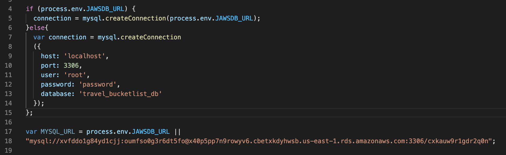

# Travel-Bucketlist


## Table of Content
- Objective
- Deploy Link
- Getting Started
- Code Highlights
- Technology
- Author 

## Objectives

I created a Travel Bucketlist app with MySQL, Node, Express, Handlebars and a homemade ORM. Use Node and MySQL to query and route data in my app, and Handlebars to generate the HTML.


## Deploy Link

https://frozen-wildwood-92430.herokuapp.com/

## Getting Started
These instructions will get you a copy of the project up and running on your local machine for development and testing purposes. See deployment for notes on how to deploy the project on a live system.

```
$ git clone git@github.com:ayladillis/Travel-Bucketlist.git
ayladillis/Travel-Bucketlist.git
$ cd ayladillis/ayladillis/Travel-Bucketlist.git
```
Then open in your preferred text editor:
- [vim](https://www.vim.org/) 
- [emmacs](https://www.gnu.org/software/emacs/)
- [visual studio code](https://code.visualstudio.com/) 

## Code Highlight

Here, on lines 4- 15 I connected to the JAWSDB as well as my local host using create connection, then on lines 17 and 18 I connected to my Heroku. 




## Technology
* [Javascript](https://developer.mozilla.org/en-US/docs/Web/JavaScrip)
* [Node.js](https://node.js.org/)
* [Sequelize](https://sequelize.org/)
* [HTML](https://en.wikipedia.org/wiki/HTML5)
* [CSS](https://www.w3.org/Style/CSS/Overview.en.html)
* [Handlebars](https://handlebarsjs.com/)
* [Express](https://expressjs.com/)


## Authors 
- [Ayla Dillis](https://github.com/ayladillis)
- [LinkedIn](https://www.linkedin.com/in/ayladillis/)
- [Portfolio](https://ayladillis.github.io/ayladillis_portfolio/)
- [Highlighted-Work](https://ayladillis.github.io/Coding-Bootcamp-Project-1-Zillow-Maps-API-AD/)
- email: aayladillis@gmail.com